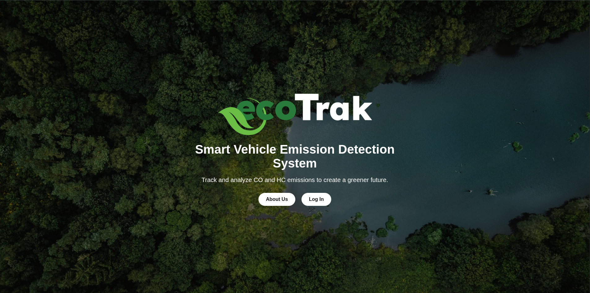
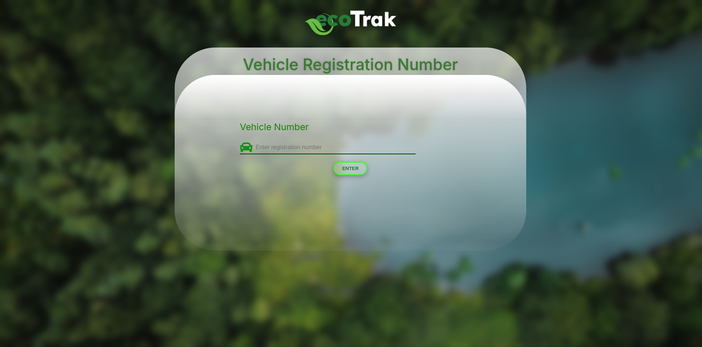
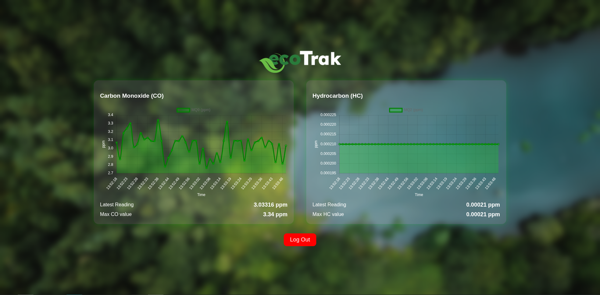

  

# ecoTrak – Smart Vehicle Emission Detection System

**ecoTrak** is an IoT-based smart emission monitoring system designed to reduce air pollution caused by vehicle emissions. Built as a second year project, this system combines real-time gas sensing hardware with a centralized web dashboard to help vehicle owners, authorities, and the general public take action toward cleaner air and climate responsibility.

> ⚠ This is a **demo repository**. Firebase credentials and sensitive configs have been removed for security reasons. Full functionality is disabled in this version.

---

##  Project Overview

In Sri Lanka, vehicle emission tests are conducted just once a year and are often bypassed by temporary tuning. ecoTrak solves this issue with:

- Real-time roadside emission checks
- Instant data upload to a centralized Firebase database
- A responsive website dashboard for authorized users

---

##  Features

- ESP32-based emission detection device
- MQ-2 and MQ-9 gas sensors (for Hydrocarbon and Carbon Monoxide)
- OLED display and 4x4 matrix keypad
- Firebase database integration
- Secure website for viewing vehicle emission history
- Google authentication for login

---

##  Tech Stack

**Hardware:**
- ESP32 DevKit v1
- MQ-2 and MQ-9 Gas Sensors
- OLED Display (128x64 I2C)
- 4x4 Matrix Keypad
- 18650 Battery Pack

**Software:**
- Website: HTML, CSS, JavaScript
- Database: Firebase Realtime Database
- Arduino IDE: For ESP32 firmware development
- Authentication: Firebase + Google Sign-In
- Figma – for wireframing and designing the website UI/UX
- Hosting: GitHub Pages / Vercel (live site not included in demo)

---

##  Screenshots

###  Main Page

###  Login Page

###  Search Page

###  Dashboard View

---

## ⚠ Demo Limitations

- Firebase authentication is **disabled** - login won’t function
- Realtime database integration is **not live**
- The website may appear functional, but no real data is fetched
- All sensitive API keys have been redacted
- This version is only for **code demonstration purposes**

---

##  Security Disclaimer

To protect user data and Firebase access, the following measures have been taken:

- All real Firebase credentials have been removed
- Service accounts are excluded from this repository

Please do not attempt to use this demo as a working deployment without configuring your own secure Firebase backend.

---

##  Contact & Team

Developed as a group project by **Group CT07**  
GTEC23032 Second Year Project – University of Kelaniya

###  Team Members

| Name               | GitHub                                  | LinkedIn                                |
|--------------------|------------------------------------------|------------------------------------------|
| **Isala Vineth**      | [@Isalavineth](https://github.com/Isalavineth)       | [Isala Vineth](https://www.linkedin.com/in/isala-vineth-174324351/)       |
| **Kavinda Dilshan**  | [@wickr4m](https://github.com/wickr4m)               | [Kavinda Dilshan](https://www.linkedin.com/in/kavinda-wickram/)               |
| **Janith Harshana**  | [@j-harshana](https://github.com/j-harshana)               | [Janith Harshana](https://www.linkedin.com/in/j-harshana/)               |
| **Kaveesha Navanjana**  | [@kaveeshanavanjana](https://github.com/kaveeshanavanjana)               | [Kaveesha Navanjana](https://www.linkedin.com/in/kaveesha-navanjana-501539292/)               |
| **Gawesh Imantha**  | [@gawe2002](https://github.com/gawe2002)               | [Gawesh Imantha](http://www.linkedin.com/in/gawesh-imantha-515591364)               |

